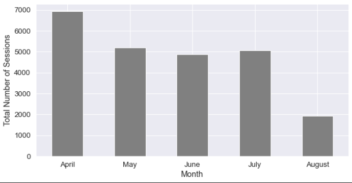

# Click Analysis

### [Report can be found here](./analysis.ipynb).

Conducted a clickstream analysis on data for an online shopping store offering clothing for pregnant women between April 2008 to August 2008. The data set is publicly posted on [UCI Machine Learning Repository](https://archive.ics.uci.edu/ml/datasets/clickstream+data+for+online+shopping). It contains approximately 160,000 rows with 14 columns and each row represents a single click per customer. Column value description can be found in the full project report.

## Motivation

To optimize the user experience on a website, it is essential to understand how customers behave on the current version of the website. Such analysis not only provides a direction to minimize customer loss but also shows how factors such as photo location, product types, and product color affect customer behavior on the online shopping site.

## Project goals

- What is the overall traffic distribution?
- Which factors of products affect customers' behavior on the website?

## Exploratory Data Analysis

### Traffic Distribution - Click/Session

Two columns indicate the user traffic: `order` and `session ID`. While each `session ID` represents a unique user in a specific time frame, `order` shows the whole sequence of customers' behavior on the website (1 indicates the first click a customer makes and 2 is the second click, and so on). Let's compare them to see if there's any difference.

   

Notice there's hardly any difference between the two distributions. Tuesday has the largest amount of traffic while weekends have the least. Recall that this website offers clothing for pregnant women, meaning that the users are most likely pregnant women themselves. Assuming most users are staying at home due to pregnancy, they might have more free time to search for clothing when other family members are not around: weekdays, especially around the afternoon. As to Tuesday having the peak, we can make a hypothesis that the more it is close to the weekends, the more time customers have to spend on the family business. Since there is not a significant difference between the two, we can safely use either of them for further analysis.

### Traffic Distribution - Countries

The majority of traffic occurs in European countries: 1. Poland (n=19582), 2. Czech Republic (n=2261), 3. Lithuania (n=527), 4. United Kingdom (n=127), 5. Ireland (n=102), 6. Germany (n=101), and 7.Slovakia (n=88).

### Traffic Distribution - Month

   

There is significantly more traffic during April. According to the birthrate analysis "[Do humans have mating seasons?](https://visme.co/blog/most-common-birthday/)", there is an interesting pattern of birth months. Around the world, there is NOT a single country with its peak birth month as April and most European countries have their peak birth month between June-September. This indicates that demand for pregnant women's clothing in European countries will be higher between February-April compared to that of June-September.

### Product Price Distribution

The clicked product price ranges between $18-$80. $40 products received the most clicks and $40 had the second most clicks.

## Click Analysis

### Q. Does the photo location significantly affect the click rate?

Notice top-left has the largest amount of traffic for most cases, while the top-right has the least amount of traffic. While the first click has the most traffic, its deviation among photo locations is larger compared to that of other click orders. As customers make more subsequent clicks, they tend to not care about photo location as much.

### Q. Any relationship between photo location and model photography?

Due to the huge overall difference in traffic between en face and profile photo types, it is difficult to draw any statistical conclusion. However, there are still a few points to which pay close attention.

1. Top-left photo location has the largest traffic discrepancy between the two photo types.
2. Bottom-center has the least traffic difference between the two photo types.
3. While the amount of traffic fluctuates among top-right, bottom-left, and bottom-right for en face type, it does not differ that much for profile photo type.

### Q. Should we inform customers that the price of a particular product is higher than the average price for other products in the same category?

Only consider the first click customers make on the website. `price 2` column indicates whether the price of a particular product is higher than the average price for the entire product category.

1. Yes: 50.48%
2. No: 49.52%

Customers are slightly more likely (~1%) to click on a particular product if it is informed that the price of it is higher than the average price for the other products in the same category. Although the difference is trivial, the result is a bit counterintuitive: customers click more for expensive products. One should be careful about drawing such a conclusion since there are other interacted factors such as color, product type, clothing model, etc.

Now, **given the first click's `price 2` value, what are the percentages of each `price 2` column value for the subsequent click?**

- First Click: Yes
  - Second Click:
    - Yes: 56.02%
    - No: 43.98%

Without taking other factors into account, customers who made the first click on the products that are informing whether the price is higher compared to the average price for other products are more likely (~12%) to click on products that are **ALSO** informing about the price.

- First Click: No
  - Second Click:
    - Yes: 44.94%
    - No: 55.05%

Customers who made the first click on the products that are NOT informing whether the price is higher than the average price for other products are much more likely (~11%) to make second clicks on the products that are NOT informing about the price as well.

### Q. What is the popular product type, color, or type-color combination?

Let's only consider the **first** click customers make when they entered the website. Without considering other factors, blue has significantly more clicks compared to other product colors. Let's consider the photo location this time.

### Color-Photo Location

Blue products located at the top left on the first page of the website have the highest number of first clicks. Now let's consider product type as well.

### Color-Product Type

Among all possible color-category combinations, the blue trouser has significantly more clicks than others on the first page. Keep in mind this is only the first response analysis: the first click each customer makes on the first page of the website.

## References

- [Sessions vs. Clicks: What’s the Difference Anyway?](https://blog.stackadapt.com/sessions-vs-clicks-what-s-the-difference-anyway)
- [Do humans have mating seasons? This heat map reveals the surprising link between birthdays and seasons](https://visme.co/blog/most-common-birthday/)
- [Human birth seasonality: latitudinal gradient and interplay with childhood disease dynamics](https://royalsocietypublishing.org/doi/10.1098/rspb.2013.2438)
