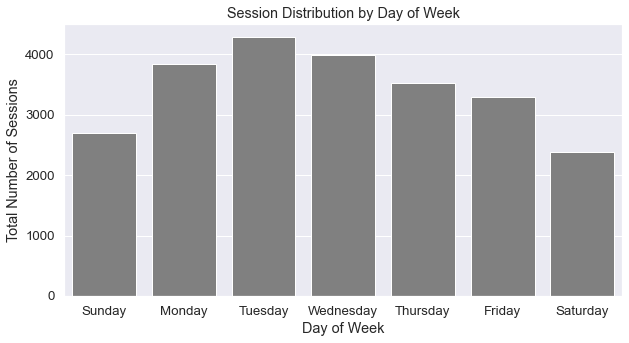

```python
import pandas as pd
import os
import duckdb
import matplotlib.pyplot as plt
import scipy.stats as stats
import seaborn as sns
from statsmodels.stats.weightstats import ztest as ztest

# embeding images
from IPython.display import Image
from IPython.core.display import HTML 
```


```python
# left-aligning column description table
```


```python
%%html
<style>
  table {margin-left: 0 !important;}
</style>
```


<style>
  table {margin-left: 0 !important;}
</style>


# E-Shop Clothing Click Analysis

The data set is from [UCI Machine Learning Repository](https://archive.ics.uci.edu/ml/datasets/clickstream+data+for+online+shopping#). According to its data set description, *the dataset contains information on clickstream from online store offering clothing for pregnant women. Data are from five months of 2008 and include, among others, product category, location of the photo on the page, country of origin of the IP address and product price in US dollars.* There are 165475 instances in total and each row consists of 14 columns as follows:

| Name | Type | Despcription |
| :-- | :-: | :-- |
| `year` | int | the year of the record: 2008 |
| `month` | int | the month of the record: from April (4) to August (8) | 
| `day` | int | day number of the month |
| `order` | int | sequence of clicks during one session | 
| `country` | int | variable indicating the country of origin of the IP address. <br>  categories are specified in the `e-shop clothing 2008 data description.txt` file in the data directory
| `session ID` | int | variable indicating session id (short record) |
| `page 1 (main category)` | int | indicates the main product category: 1-trousers, 2-skirts, 3-blouses, 4-sale
| `page 2 (clothing model)` | str | contains information about thre code for each product (217 products in total) |
| `colour` | int | color of product <br> 1-beige, 2-black, 3-blue, 4-brown, 5-burgundy, 6-gray, 7-green, 8-navy blue, <br> 9-of many colors, 10-olive, 11-pink, 12-red, 13-violet, 14-white|
| `location` | int | photo location on the page, the screen has been divided into six parts <br> 1-top left, 2-top center, 3-top right 4-bottom left, 5-bottom center, 6-bottom right| 
| `model photography` | int | variable with two categories: 1-en face, 2-profile |
| `price` | int | price in US dollars |
| `price 2` | int | variable informing whether the price of a particular product is higher than the average price for the entire product category <br> 1-yes, 2-no| 
| `page` | int | page number within the e-store website (from 1 to 5) |

## Domain Knowledge

Before diving into analysis, it is important to understand the context of the value of each column and row. The following websites help readers to gain knowledge of this dataset.

- [Difference between sessions and clicks](https://blog.stackadapt.com/sessions-vs-clicks-what-s-the-difference-anyway): Session is each user making certain interactions with your website within a given timeframe while click is an action of users selecting certain elements of the website. In the data set, `session ID` indicates an unique activity of users (possibly the same user) and `order` column represents the sequence of clicks during a specific session. For most cases, there are multiple clicks during a single session.

## Import / Exploratory Data Analysis

Import the data and conduct an exploratory data analysis to get an overall sense of the data set.

Possible questions to answer:

1. How is the amount of traffic distributed across the days of the month?
2. How is the amount of traffic distributed across the countries?
3. Average number of clicks during one session.


```python
# import the data by specifying the separator as ";"
click = pd.read_csv(os.path.join("data", "e-shop clothing 2008.csv"), sep=";")
print(" Row: ", str(click.shape[0]), "\n", "Column: ", str(click.shape[1]))

# printing out first 5 rows of the data
click.head(5)
```

     Row:  165474 
     Column:  14


<div>
<style scoped>
    .dataframe tbody tr th:only-of-type {
        vertical-align: middle;
    }

    .dataframe tbody tr th {
        vertical-align: top;
    }

    .dataframe thead th {
        text-align: right;
    }
</style>
<table border="1" class="dataframe">
  <thead>
    <tr style="text-align: right;">
      <th></th>
      <th>year</th>
      <th>month</th>
      <th>day</th>
      <th>order</th>
      <th>country</th>
      <th>session ID</th>
      <th>page 1 (main category)</th>
      <th>page 2 (clothing model)</th>
      <th>colour</th>
      <th>location</th>
      <th>model photography</th>
      <th>price</th>
      <th>price 2</th>
      <th>page</th>
    </tr>
  </thead>
  <tbody>
    <tr>
      <th>0</th>
      <td>2008</td>
      <td>4</td>
      <td>1</td>
      <td>1</td>
      <td>29</td>
      <td>1</td>
      <td>1</td>
      <td>A13</td>
      <td>1</td>
      <td>5</td>
      <td>1</td>
      <td>28</td>
      <td>2</td>
      <td>1</td>
    </tr>
    <tr>
      <th>1</th>
      <td>2008</td>
      <td>4</td>
      <td>1</td>
      <td>2</td>
      <td>29</td>
      <td>1</td>
      <td>1</td>
      <td>A16</td>
      <td>1</td>
      <td>6</td>
      <td>1</td>
      <td>33</td>
      <td>2</td>
      <td>1</td>
    </tr>
    <tr>
      <th>2</th>
      <td>2008</td>
      <td>4</td>
      <td>1</td>
      <td>3</td>
      <td>29</td>
      <td>1</td>
      <td>2</td>
      <td>B4</td>
      <td>10</td>
      <td>2</td>
      <td>1</td>
      <td>52</td>
      <td>1</td>
      <td>1</td>
    </tr>
    <tr>
      <th>3</th>
      <td>2008</td>
      <td>4</td>
      <td>1</td>
      <td>4</td>
      <td>29</td>
      <td>1</td>
      <td>2</td>
      <td>B17</td>
      <td>6</td>
      <td>6</td>
      <td>2</td>
      <td>38</td>
      <td>2</td>
      <td>1</td>
    </tr>
    <tr>
      <th>4</th>
      <td>2008</td>
      <td>4</td>
      <td>1</td>
      <td>5</td>
      <td>29</td>
      <td>1</td>
      <td>2</td>
      <td>B8</td>
      <td>4</td>
      <td>3</td>
      <td>2</td>
      <td>52</td>
      <td>1</td>
      <td>1</td>
    </tr>
  </tbody>
</table>
</div>


```python
# data type of each column
click.dtypes
```


    year                        int64
    month                       int64
    day                         int64
    order                       int64
    country                     int64
    session ID                  int64
    page 1 (main category)      int64
    page 2 (clothing model)    object
    colour                      int64
    location                    int64
    model photography           int64
    price                       int64
    price 2                     int64
    page                        int64
    dtype: object


### 1. Traffic Distribution Accross the Days of Week

First, create a date column with given year, month, and day columns and extract the weekday for the analysis. Then, count the total number of 1) `clicks` and 2) `sessions` to compare the amount of traffic per weekday.

#### Total Number of Clicks per Weekday


```python
# create weekday column by
# 1. create date columen by combining year, month, and day column
# 2. extract weekday from the newly created date column
temp1 = duckdb.query("""
    SELECT
        CASE
            WHEN dt = 0 THEN 'Sunday'
            WHEN dt = 1 THEN 'Monday'
            WHEN dt = 2 THEN 'Tuesday'
            WHEN dt = 3 THEN 'Wednesday'
            WHEN dt = 4 THEN 'Thursday'
            WHEN dt = 5 THEN 'Friday'
            ELSE 'Saturday'
        END AS day,
        COUNT(*) AS total
    FROM
        (SELECT *, DAYOFWEEK(MAKE_DATE(year, month, day)) AS dt
        FROM click) AS t1
    GROUP BY dt
    ORDER BY dt
""").df()

temp1
```


<div>
<style scoped>
    .dataframe tbody tr th:only-of-type {
        vertical-align: middle;
    }

    .dataframe tbody tr th {
        vertical-align: top;
    }

    .dataframe thead th {
        text-align: right;
    }
</style>
<table border="1" class="dataframe">
  <thead>
    <tr style="text-align: right;">
      <th></th>
      <th>day</th>
      <th>total</th>
    </tr>
  </thead>
  <tbody>
    <tr>
      <th>0</th>
      <td>Sunday</td>
      <td>18758</td>
    </tr>
    <tr>
      <th>1</th>
      <td>Monday</td>
      <td>25241</td>
    </tr>
    <tr>
      <th>2</th>
      <td>Tuesday</td>
      <td>28697</td>
    </tr>
    <tr>
      <th>3</th>
      <td>Wednesday</td>
      <td>27959</td>
    </tr>
    <tr>
      <th>4</th>
      <td>Thursday</td>
      <td>25356</td>
    </tr>
    <tr>
      <th>5</th>
      <td>Friday</td>
      <td>22684</td>
    </tr>
    <tr>
      <th>6</th>
      <td>Saturday</td>
      <td>16779</td>
    </tr>
  </tbody>
</table>
</div>


```python
# default setting of the seaborn plot
sns.set_theme()

# specifying the figure size
sns.set(rc={"figure.figsize":(10, 5)}) #width=10, height=5

# increase font size of all elements
sns.set(font_scale=1.2)

# barplot with appropriate labels
p = sns.barplot(x='day', y='total', data=temp1, color='gray')
p.set(xlabel="Day of Week", ylabel="Total Number of Clicks", title= "Click Distribution by Day of Week")

plt.show()
```


    

    


#### Total Number of Sessions per Weekday


```python
# create weekday column by
# 1. create date columen by combining year, month, and day column
# 2. extract weekday from the newly created date column
# 3. count the number of unique session ID
temp2 = duckdb.query("""
    SELECT
        CASE
            WHEN dt = 0 THEN 'Sunday'
            WHEN dt = 1 THEN 'Monday'
            WHEN dt = 2 THEN 'Tuesday'
            WHEN dt = 3 THEN 'Wednesday'
            WHEN dt = 4 THEN 'Thursday'
            WHEN dt = 5 THEN 'Friday'
            ELSE 'Saturday'
        END AS day,
        COUNT(*) AS total
    FROM
        (SELECT DISTINCT "session ID", DAYOFWEEK(MAKE_DATE(year, month, day)) AS dt
        FROM click) AS t1
    GROUP BY dt
    ORDER BY dt
""").df()

temp2 
```


<div>
<style scoped>
    .dataframe tbody tr th:only-of-type {
        vertical-align: middle;
    }

    .dataframe tbody tr th {
        vertical-align: top;
    }

    .dataframe thead th {
        text-align: right;
    }
</style>
<table border="1" class="dataframe">
  <thead>
    <tr style="text-align: right;">
      <th></th>
      <th>day</th>
      <th>total</th>
    </tr>
  </thead>
  <tbody>
    <tr>
      <th>0</th>
      <td>Sunday</td>
      <td>2693</td>
    </tr>
    <tr>
      <th>1</th>
      <td>Monday</td>
      <td>3846</td>
    </tr>
    <tr>
      <th>2</th>
      <td>Tuesday</td>
      <td>4287</td>
    </tr>
    <tr>
      <th>3</th>
      <td>Wednesday</td>
      <td>3994</td>
    </tr>
    <tr>
      <th>4</th>
      <td>Thursday</td>
      <td>3530</td>
    </tr>
    <tr>
      <th>5</th>
      <td>Friday</td>
      <td>3293</td>
    </tr>
    <tr>
      <th>6</th>
      <td>Saturday</td>
      <td>2383</td>
    </tr>
  </tbody>
</table>
</div>


```python
# default setting of the seaborn plot
sns.set_theme()

# specifying the figure size
sns.set(rc={"figure.figsize":(10, 5)}) #width=10, height=5

# increase font size of all elements
sns.set(font_scale=1.2)

# barplot with appropriate labels
p = sns.barplot(x='day', y='total', data=temp2, color='gray')
p.set(xlabel="Day of Week", ylabel="Total Number of Sessions", title= "Session Distribution by Day of Week")

plt.show()
```


    

    


Notice the click and session distribution accross the day of week are approximately the same. Saturday has the lowest amount of traffic while Tuesday has the largest amount of traffic for both distributions. It is difficult to find the specific reasons behind this distribution, but we can certainly come up with a hypothesis:

- Recall that this website offers clothings for pregnant women, meaing that the users are most likely pregnant women. Assuming most users are staying at home due to pregnancy, they might have more free time to search for clothings when other family members are not around: weekdays, especially around afternoon.

### 2. Session Distribution Across Countries

Based on the country code specified in `e-shop clothing 2008 data description.txt` file, most of the traffic occured at European countries (mostly Poland).


```python
# group by countries and count the total unqiue sessions
duckdb.query("""
    SELECT CASE
        WHEN country = 29 THEN 'Poland'
        WHEN country = 9  THEN 'Czech Republic'
        WHEN country = 46 THEN '*.net'
        WHEN country = 24 THEN 'Lithuania'
        WHEN country = 44 THEN '*.com'
        WHEN country = 41 THEN 'United Kingdom'
        WHEN country = 21 THEN 'Ireland'
        WHEN country = 16 THEN 'Germany'
        WHEN country = 34 THEN 'Slovakia'
        WHEN country = 12 THEN 'unidentified'
    END AS coutry
        , COUNT(*) AS total
    FROM
        (SELECT DISTINCT "session ID", country
        FROM click) AS t1
    GROUP BY country
    ORDER BY total DESC
""").df().head(10)
```


<div>
<style scoped>
    .dataframe tbody tr th:only-of-type {
        vertical-align: middle;
    }

    .dataframe tbody tr th {
        vertical-align: top;
    }

    .dataframe thead th {
        text-align: right;
    }
</style>
<table border="1" class="dataframe">
  <thead>
    <tr style="text-align: right;">
      <th></th>
      <th>coutry</th>
      <th>total</th>
    </tr>
  </thead>
  <tbody>
    <tr>
      <th>0</th>
      <td>Poland</td>
      <td>19582</td>
    </tr>
    <tr>
      <th>1</th>
      <td>Czech Republic</td>
      <td>2261</td>
    </tr>
    <tr>
      <th>2</th>
      <td>*.net</td>
      <td>681</td>
    </tr>
    <tr>
      <th>3</th>
      <td>Lithuania</td>
      <td>527</td>
    </tr>
    <tr>
      <th>4</th>
      <td>*.com</td>
      <td>240</td>
    </tr>
    <tr>
      <th>5</th>
      <td>United Kingdom</td>
      <td>127</td>
    </tr>
    <tr>
      <th>6</th>
      <td>Ireland</td>
      <td>102</td>
    </tr>
    <tr>
      <th>7</th>
      <td>Germany</td>
      <td>101</td>
    </tr>
    <tr>
      <th>8</th>
      <td>Slovakia</td>
      <td>88</td>
    </tr>
    <tr>
      <th>9</th>
      <td>unidentified</td>
      <td>28</td>
    </tr>
  </tbody>
</table>
</div>


### 3. Session Distribution Across the Months


```python
# group by countries and count the total unqiue sessions
temp3 = duckdb.query("""
    SELECT
        CASE
            WHEN dt = 4 THEN 'April'
            WHEN dt = 5 THEN 'May'
            WHEN dt = 6 THEN 'June'
            WHEN dt = 7 THEN 'July'
            ELSE 'August'
        END AS month,
        COUNT(*) AS total
    FROM
        (SELECT DISTINCT "session ID", month(MAKE_DATE(year, month, day)) AS dt, country
        FROM click) AS t1
    GROUP BY dt
    ORDER BY total DESC
""").df()

# plot the dataframe accordingly
p = temp3.plot(kind="bar", x='month', y='total',
          xlabel="Month", ylabel="Total Number of Sessions", legend=False, color='gray')

# setting the rotation of the xlabel as 0 
# turns out the default rotation of the xlabel of seaborn plot object is 90 degree
p.tick_params(axis='x', rotation=0)
```


    

    


There is significantly more traffic during April. Accoring to the birthrate analysis ["Do humans have mating seasons?"](https://visme.co/blog/most-common-birthday/), there is an interesting pattern of birth months. Around the world, there is NOT a single country with its peak birth month as April and most european countries have their peak birth month bewteen June-September. This indicates that demand for prenant women's clothing in european countries will be higher between February-April. 


```python
# from https://royalsocietypublishing.org/doi/10.1098/rspb.2013.2438
Image(filename = "./img/1.peak-birth-month.png", width=500, height=500)
```


    

    


### 4. Product Price Distribution


```python
# minimum and maximum product price in US Dollar
duckdb.query("""
    SELECT
        MIN(price) AS min_price,
        MAX(price) AS max_price
    FROM click
""").df()
```


<div>
<style scoped>
    .dataframe tbody tr th:only-of-type {
        vertical-align: middle;
    }

    .dataframe tbody tr th {
        vertical-align: top;
    }

    .dataframe thead th {
        text-align: right;
    }
</style>
<table border="1" class="dataframe">
  <thead>
    <tr style="text-align: right;">
      <th></th>
      <th>min_price</th>
      <th>max_price</th>
    </tr>
  </thead>
  <tbody>
    <tr>
      <th>0</th>
      <td>18</td>
      <td>82</td>
    </tr>
  </tbody>
</table>
</div>


```python
# create a new figure
fig, ax = plt.subplots(figsize=(10,5))

# plot a histogram for price
sns.histplot(ax=ax, data=click[["price"]], bins=10, legend=False)

# set labels
ax.set_xlabel("Price")

plt.show()
```


    

    


---

## Click Analysis

Questions to ask:

1. Does photo location significantly affect the click rate?
2. Is there an interaction effect between photo location and model photography (wheter it is en face or profile)?
3. Should we inform users whether the price of a particular product is higher than the average price of other products in the same category?

### Does the photo location significantly affect the click rate?

The `order` columns indicates the sequence of clicks of an user (session ID). Thus, to thoroughly investigate users' behavior in the website, the order of clicks must be taken into consideration rather than naively counting the total number of clicks per photo location. 

**Q. Which photo location is more likely to attract users when they first visit the website? Is it significantly different from others?**

First, consider the first click of each session.


```python
# filter out clicks other than the first one (order = 1)
# then group by photo location to count the total number of first clicks per photo location
temp4 = duckdb.query("""
    SELECT location, COUNT(*) AS first
    FROM click 
    WHERE "order" = 1
    GROUP BY location
    ORDER BY first DESC
""").df()

temp4

# recall:
# 1 - top left
# 2 - top center
# 3 - top roght
# 4 - bottom left
# 5 - bottom center
# 6 - bottom right
```


<div>
<style scoped>
    .dataframe tbody tr th:only-of-type {
        vertical-align: middle;
    }

    .dataframe tbody tr th {
        vertical-align: top;
    }

    .dataframe thead th {
        text-align: right;
    }
</style>
<table border="1" class="dataframe">
  <thead>
    <tr style="text-align: right;">
      <th></th>
      <th>location</th>
      <th>first</th>
    </tr>
  </thead>
  <tbody>
    <tr>
      <th>0</th>
      <td>1</td>
      <td>6159</td>
    </tr>
    <tr>
      <th>1</th>
      <td>2</td>
      <td>4916</td>
    </tr>
    <tr>
      <th>2</th>
      <td>5</td>
      <td>3963</td>
    </tr>
    <tr>
      <th>3</th>
      <td>4</td>
      <td>3821</td>
    </tr>
    <tr>
      <th>4</th>
      <td>6</td>
      <td>2718</td>
    </tr>
    <tr>
      <th>5</th>
      <td>3</td>
      <td>2449</td>
    </tr>
  </tbody>
</table>
</div>


```python
# perform one sample z-test

ztest(temp4["first"], value=6159)
```


    (-3.8123733923460095, 0.00013763873686633375)


With the p-value of 0.00014, **the photo location of top-left attracts significnatly more users than other locations**. Another interesting point about user behavior is that they prefer left and bottom position of the photo. Notice top-left and top-center have the highest number of users and bottom-center and bottom-left follow. It is less likely for users to click photos located at either bottom-right or top right.

Now, let's consider subsequent clicks.


```python
# count the number of clicks per each click order and join them altogether
temp5 = duckdb.query("""
    SELECT *
    FROM temp4
    LEFT JOIN 
        (SELECT location, COUNT(*) AS 'second'
        FROM click 
        WHERE "order" = 2
        GROUP BY location) AS t1
    USING (location)
    LEFT JOIN 
        (SELECT location, COUNT(*) AS third
        FROM click 
        WHERE "order" = 3
        GROUP BY location) AS t2
    USING (location)
    LEFT JOIN 
        (SELECT location, COUNT(*) AS fourth
        FROM click 
        WHERE "order" = 4
        GROUP BY location) AS t3
    USING (location)
    LEFT JOIN 
        (SELECT location, COUNT(*) AS fifth
        FROM click 
        WHERE "order" = 5
        GROUP BY location) AS t4
    USING (location)
""").df()

temp5
```


<div>
<style scoped>
    .dataframe tbody tr th:only-of-type {
        vertical-align: middle;
    }

    .dataframe tbody tr th {
        vertical-align: top;
    }

    .dataframe thead th {
        text-align: right;
    }
</style>
<table border="1" class="dataframe">
  <thead>
    <tr style="text-align: right;">
      <th></th>
      <th>location</th>
      <th>first</th>
      <th>second</th>
      <th>third</th>
      <th>fourth</th>
      <th>fifth</th>
    </tr>
  </thead>
  <tbody>
    <tr>
      <th>0</th>
      <td>1</td>
      <td>6159</td>
      <td>4253</td>
      <td>3177</td>
      <td>2522</td>
      <td>2086</td>
    </tr>
    <tr>
      <th>1</th>
      <td>2</td>
      <td>4916</td>
      <td>3772</td>
      <td>3241</td>
      <td>2795</td>
      <td>2268</td>
    </tr>
    <tr>
      <th>2</th>
      <td>5</td>
      <td>3963</td>
      <td>3305</td>
      <td>2629</td>
      <td>2259</td>
      <td>1894</td>
    </tr>
    <tr>
      <th>3</th>
      <td>4</td>
      <td>3821</td>
      <td>3151</td>
      <td>2726</td>
      <td>2144</td>
      <td>1798</td>
    </tr>
    <tr>
      <th>4</th>
      <td>6</td>
      <td>2718</td>
      <td>2202</td>
      <td>1887</td>
      <td>1600</td>
      <td>1395</td>
    </tr>
    <tr>
      <th>5</th>
      <td>3</td>
      <td>2449</td>
      <td>2301</td>
      <td>2004</td>
      <td>1724</td>
      <td>1566</td>
    </tr>
  </tbody>
</table>
</div>


```python
# create a new figure
fig, ax = plt.subplots(figsize=(10,5))

# plot a scatter plot for each order of click
sns.scatterplot(ax=ax, data=temp5, x="location", y="first")
sns.scatterplot(ax=ax, data=temp5, x="location", y="second")
sns.scatterplot(ax=ax, data=temp5, x="location", y="third")
sns.scatterplot(ax=ax, data=temp5, x="location", y="fourth")
sns.scatterplot(ax=ax, data=temp5, x="location", y="fifth")
fig.legend(labels=["First", "Second", "Third", "Fourth", "Fifth"], title="Order of Click")

# setting labels properly
ax.set_xlabel("Photo Location")
ax.set_ylabel("Total Number of Clicks")

# manually change x tick labels from numeric code to the actual photo location
# first, set the location of x ticks and change the x labels appropriately
ax.set_xticks(range(1, 7), labels=["Top-Left", "Top-Center", "Top-Right", "Bottom-Left", "Bottom-Center", "Bottom-Right"])

plt.show()
```


    

    


Notice top-left has the largest amount of traffic for the most cases, while top-right has the least amount of traffic. For 'unpopular' photo location, top-right and bottom-right, the deviation among order of clicks is small compared to more popular photo locations such as top-left and top-center.

### Is there an interaction effect between photo location and model photography?

Let's only consider the first click users make.


```python
temp6 = duckdb.query("""
    SELECT location, COUNT(*) AS total,
        CASE
            WHEN "model photography" = 1 THEN 'en face'
            ELSE 'profile'
        END AS "model photography"
    FROM
        (SELECT *
        FROM click
        WHERE "order" = 1 AND ("model photography" = 1 OR "model photography" = 2)) AS t1
    GROUP BY location, "model photography"
""").df()

temp6
```


<div>
<style scoped>
    .dataframe tbody tr th:only-of-type {
        vertical-align: middle;
    }

    .dataframe tbody tr th {
        vertical-align: top;
    }

    .dataframe thead th {
        text-align: right;
    }
</style>
<table border="1" class="dataframe">
  <thead>
    <tr style="text-align: right;">
      <th></th>
      <th>location</th>
      <th>total</th>
      <th>model photography</th>
    </tr>
  </thead>
  <tbody>
    <tr>
      <th>0</th>
      <td>4</td>
      <td>3302</td>
      <td>en face</td>
    </tr>
    <tr>
      <th>1</th>
      <td>2</td>
      <td>3701</td>
      <td>en face</td>
    </tr>
    <tr>
      <th>2</th>
      <td>1</td>
      <td>5248</td>
      <td>en face</td>
    </tr>
    <tr>
      <th>3</th>
      <td>6</td>
      <td>2232</td>
      <td>en face</td>
    </tr>
    <tr>
      <th>4</th>
      <td>5</td>
      <td>2190</td>
      <td>en face</td>
    </tr>
    <tr>
      <th>5</th>
      <td>3</td>
      <td>1946</td>
      <td>en face</td>
    </tr>
    <tr>
      <th>6</th>
      <td>5</td>
      <td>1773</td>
      <td>profile</td>
    </tr>
    <tr>
      <th>7</th>
      <td>1</td>
      <td>911</td>
      <td>profile</td>
    </tr>
    <tr>
      <th>8</th>
      <td>4</td>
      <td>519</td>
      <td>profile</td>
    </tr>
    <tr>
      <th>9</th>
      <td>3</td>
      <td>503</td>
      <td>profile</td>
    </tr>
    <tr>
      <th>10</th>
      <td>2</td>
      <td>1215</td>
      <td>profile</td>
    </tr>
    <tr>
      <th>11</th>
      <td>6</td>
      <td>486</td>
      <td>profile</td>
    </tr>
  </tbody>
</table>
</div>


```python
# create a new figure
fig, ax = plt.subplots(figsize=(10,5))

# plot a scatter plot for each order of click
sns.barplot(ax=ax, data=temp6, x="location", y="total", hue="model photography")

# # set the labels
ax.set_xlabel("Photo Location")
ax.set_ylabel("Total Number of Clicks")

# manually change x tick labels from numeric code to the actual photo location
# first, set the location of x ticks and change the x labels appropriately
ax.set_xticks(range(6), labels=["Top-Left", "Top-Center", "Top-Right", "Bottom-Left", "Bottom-Center", "Bottom-Right"])

# update legend position
plt.legend(loc='upper right')

plt.show()
```


    

    


Due to huge overall difference of traffic between en face and profile photo type, it is difficult to draw any statistical conclusion. However, there are still few points to which pay close attention.

1. Top-left photo location has the largest traffic discrepency between two photo types.
2. Bottom-center has the least traffic difference between two photo types.
3. While the amount of traffic fluctuates among top-right, bottom-left, and bottom-right for en face type, it does not differ that much for profile photo type.

### Should we inform customers that the price of a particular product is higher than the average price for other products in the same category?

Recall that `1` indicates 'Yes' (informing customers that this product is more expensive compared to the average price for other products) and `2` indicates 'No'.


```python
# among the first clicks, what is the percentage of each `price 2` column value?
duckdb.query("""
    SELECT
        CASE
            WHEN "price 2" = 1 THEN 'Yes'
            ELSE 'No'
        END AS "price 2",
        total / SUM(total) OVER()::DECIMAL * 100 AS percentage 
    FROM (
        SELECT "price 2", COUNT(*) AS total
        FROM click
        WHERE "order" = 1
        GROUP BY "price 2") AS t1
    ORDER BY percentage DESC
""").df()
```


<div>
<style scoped>
    .dataframe tbody tr th:only-of-type {
        vertical-align: middle;
    }

    .dataframe tbody tr th {
        vertical-align: top;
    }

    .dataframe thead th {
        text-align: right;
    }
</style>
<table border="1" class="dataframe">
  <thead>
    <tr style="text-align: right;">
      <th></th>
      <th>price 2</th>
      <th>percentage</th>
    </tr>
  </thead>
  <tbody>
    <tr>
      <th>0</th>
      <td>Yes</td>
      <td>50.48281</td>
    </tr>
    <tr>
      <th>1</th>
      <td>No</td>
      <td>49.51719</td>
    </tr>
  </tbody>
</table>
</div>


Customers are slightly more likely (~1%) click a particular product if it is informed that the price of it is higher than the average price for the other products in the same category. Although the difference is trivial, the result is a bit counterintuitive: customers click more for expensive products. One should be careful for drawing such conclusion since there are other interacted factors such as colour, product type, clothing model, etc.

Now, only consider sessions making more than 1 click for subsequent click analysis: **given first click's `price 2` value, what are the percentage of each `price 2` columne value for the next click?**

1. Filter out sessions with less than 2 clicks.
2. Of selected sessions, filter out rows whose `price 2` column value is not 1 (not 2 - for the second analysis).
3. Calculate percentage of each `price 2` value.

Given the first click's `price 2` value is 'Yes', the percentage for each `price 2` column value is as follows:


```python
duckdb.query("""
    WITH temp1 AS
    (
        SELECT "session ID", "order", "price 2"
        FROM (
            SELECT *,
                COUNT(*) OVER(PARTITION BY "session ID") AS total
            FROM click
            WHERE "order" = 1 OR "order" = 2
            ORDER BY "session ID") AS t1
        WHERE total = 2
    ),
    
    temp2 AS
    (   
        SELECT *
        FROM temp1
        WHERE "order" = 1 AND "price 2" = 1
    ),
    
    temp3 AS
    (
        -- Only select sessions whose first click 'price 2' column value is 1
        SELECT *
        FROM temp1
        WHERE "session ID" IN (SELECT "session ID" FROM temp2)
        ORDER BY "session ID", "order"
    )
    
    SELECT
        CASE
            WHEN "price 2" = 1 THEN 'Yes'
            ELSE 'No'
        END AS "price 2",
        total / SUM(total) OVER()::DECIMAL * 100 AS percentage
    FROM (
        SELECT
            "price 2",
            COUNT(*) AS total
        FROM temp3
        WHERE "order" = 2
        GROUP BY "price 2"
        ) AS t1
    
""").df()
```


<div>
<style scoped>
    .dataframe tbody tr th:only-of-type {
        vertical-align: middle;
    }

    .dataframe tbody tr th {
        vertical-align: top;
    }

    .dataframe thead th {
        text-align: right;
    }
</style>
<table border="1" class="dataframe">
  <thead>
    <tr style="text-align: right;">
      <th></th>
      <th>price 2</th>
      <th>percentage</th>
    </tr>
  </thead>
  <tbody>
    <tr>
      <th>0</th>
      <td>Yes</td>
      <td>56.018081</td>
    </tr>
    <tr>
      <th>1</th>
      <td>No</td>
      <td>43.981919</td>
    </tr>
  </tbody>
</table>
</div>


Without taking account for other factors, customers who made first click on the products that are informing whether the price is higher compared to the average price for other products are more likely (~12%) to click products that are ALSO informing about the price.

Now, repeat this analysis for rows whose first click `price 2` value is 2 (No).


```python
duckdb.query("""
    WITH temp1 AS
    (
        SELECT "session ID", "order", "price 2"
        FROM (
            SELECT *,
                COUNT(*) OVER(PARTITION BY "session ID") AS total
            FROM click
            WHERE "order" = 1 OR "order" = 2
            ORDER BY "session ID") AS t1
        WHERE total = 2
    ),
    
    temp2 AS
    (   
        SELECT *
        FROM temp1
        WHERE "order" = 1 AND "price 2" = 2
    ),
    
    temp3 AS
    (
        -- Only select sessions whose first click 'price 2' column value is 2
        SELECT *
        FROM temp1
        WHERE "session ID" IN (SELECT "session ID" FROM temp2)
        ORDER BY "session ID", "order"
    )
    
    SELECT
        CASE
            WHEN "price 2" = 1 THEN 'Yes'
            ELSE 'No'
        END AS "price 2",
        total / SUM(total) OVER()::DECIMAL * 100 AS percentage
    FROM (
        SELECT
            "price 2",
            COUNT(*) AS total
        FROM temp3
        WHERE "order" = 2
        GROUP BY "price 2"
        ) AS t1
    
""").df()
```


<div>
<style scoped>
    .dataframe tbody tr th:only-of-type {
        vertical-align: middle;
    }

    .dataframe tbody tr th {
        vertical-align: top;
    }

    .dataframe thead th {
        text-align: right;
    }
</style>
<table border="1" class="dataframe">
  <thead>
    <tr style="text-align: right;">
      <th></th>
      <th>price 2</th>
      <th>percentage</th>
    </tr>
  </thead>
  <tbody>
    <tr>
      <th>0</th>
      <td>No</td>
      <td>55.052265</td>
    </tr>
    <tr>
      <th>1</th>
      <td>Yes</td>
      <td>44.947735</td>
    </tr>
  </tbody>
</table>
</div>


Customers who made first click on the products that are NOT informing whether the price is higher than the average price for other products are much more likely (~11%) to make second clicks on the products that are NOT informing about the price as well.

### What is the popular product type, color, or type-color combination?

Without taking other factors into consideration, blue has significantly more clicks compared to other product colors. Let's consider photo location this time.


```python
# create tables for color / photo location / product category
duckdb.query("""
    DROP TABLE IF EXISTS color;
    CREATE TABLE color(code INTEGER, color CHAR);
    
    INSERT INTO color VALUES (1, 'beige');
    INSERT INTO color VALUES (2, 'black');
    INSERT INTO color VALUES (3, 'blue');
    INSERT INTO color VALUES (4, 'brown');
    INSERT INTO color VALUES (5, 'burgundy');
    INSERT INTO color VALUES (6, 'gray');
    INSERT INTO color VALUES (7, 'green');
    INSERT INTO color VALUES (8, 'navy blue');
    INSERT INTO color VALUES (9, 'of many colors');
    INSERT INTO color VALUES (10, 'olive');
    INSERT INTO color VALUES (11, 'pink');
    INSERT INTO color VALUES (12, 'red');
    INSERT INTO color VALUES (13, 'violet');
    INSERT INTO color VALUES (14, 'white');
""")

duckdb.query("""
    DROP TABLE IF EXISTS photo_loc;
    CREATE TABLE photo_loc(code INTEGER, loc CHAR);
    
    INSERT INTO photo_loc VALUES (1, 'Top Left');
    INSERT INTO photo_loc VALUES (2, 'Top Center');
    INSERT INTO photo_loc VALUES (3, 'Top Right');
    INSERT INTO photo_loc VALUES (4, 'Bottom Left');
    INSERT INTO photo_loc VALUES (5, 'Bottom Cetner');
    INSERT INTO photo_loc VALUES (6, 'Botteom Right');
""")

duckdb.query("""
    DROP TABLE IF EXISTS category;
    CREATE TABLE category(code INTEGER, type CHAR);
    
    INSERT INTO category VALUES (1, 'trousers');
    INSERT INTO category VALUES (2, 'skirts');
    INSERT INTO category VALUES (3, 'blouses');
    INSERT INTO category VALUES (4, 'sale');
""")
```


```python
# number of the first clicks on the first page for each color product and photo location
temp7 = duckdb.query("""
    SELECT color, loc, total
    FROM
    (
        SELECT colour, location, COUNT(*) AS total
        FROM click
        WHERE page = 1 AND "order" = 1
        GROUP BY colour, location
        ORDER BY total DESC
    ) AS t1
    LEFT JOIN color AS t2
    ON t1.colour = t2.code
    LEFT JOIN photo_loc AS t3
    ON t1.location = t3.code
    ORDER BY total DESC
""").df()

temp7.head(5)
```


<div>
<style scoped>
    .dataframe tbody tr th:only-of-type {
        vertical-align: middle;
    }

    .dataframe tbody tr th {
        vertical-align: top;
    }

    .dataframe thead th {
        text-align: right;
    }
</style>
<table border="1" class="dataframe">
  <thead>
    <tr style="text-align: right;">
      <th></th>
      <th>color</th>
      <th>loc</th>
      <th>total</th>
    </tr>
  </thead>
  <tbody>
    <tr>
      <th>0</th>
      <td>blue</td>
      <td>Top Left</td>
      <td>2235</td>
    </tr>
    <tr>
      <th>1</th>
      <td>blue</td>
      <td>Top Center</td>
      <td>1596</td>
    </tr>
    <tr>
      <th>2</th>
      <td>black</td>
      <td>Bottom Left</td>
      <td>1508</td>
    </tr>
    <tr>
      <th>3</th>
      <td>navy blue</td>
      <td>Top Left</td>
      <td>1231</td>
    </tr>
    <tr>
      <th>4</th>
      <td>blue</td>
      <td>Bottom Left</td>
      <td>1027</td>
    </tr>
  </tbody>
</table>
</div>


```python
# create a new figure
fig, ax = plt.subplots(figsize=(10,5))

# plot a scatter plot for each order of click
sns.scatterplot(ax=ax, data=temp7, x="color", y="total", hue="loc")

# # set the labels
ax.set_xlabel("Color of Product")
ax.set_ylabel("Total Number of Clicks")

# move xaxis label further down
ax.xaxis.labelpad = 20

# rotate x label 
ax.tick_params(axis="x", rotation=90)

# update legend position
plt.legend(loc='upper right')

plt.show()
```


    

    


Blue products that are located at the top left on the first page of the website has the highest number of first clicks.


```python
temp8 = duckdb.query("""
    SELECT color, type, total
    FROM
    (
        SELECT colour, "page 1 (main category)" AS category, COUNT(*) AS total
        FROM click
        WHERE page = 1 AND "order" = 1
        GROUP BY colour, category
        ORDER BY total DESC
    ) AS t1
    LEFT JOIN color AS t2
    ON t1.colour = t2.code
    LEFT JOIN category AS t3
    ON t1.category = t3.code
    ORDER BY total DESC
""").df()

temp8.head()
```


<div>
<style scoped>
    .dataframe tbody tr th:only-of-type {
        vertical-align: middle;
    }

    .dataframe tbody tr th {
        vertical-align: top;
    }

    .dataframe thead th {
        text-align: right;
    }
</style>
<table border="1" class="dataframe">
  <thead>
    <tr style="text-align: right;">
      <th></th>
      <th>color</th>
      <th>type</th>
      <th>total</th>
    </tr>
  </thead>
  <tbody>
    <tr>
      <th>0</th>
      <td>blue</td>
      <td>trousers</td>
      <td>4535</td>
    </tr>
    <tr>
      <th>1</th>
      <td>black</td>
      <td>skirts</td>
      <td>1529</td>
    </tr>
    <tr>
      <th>2</th>
      <td>navy blue</td>
      <td>trousers</td>
      <td>1231</td>
    </tr>
    <tr>
      <th>3</th>
      <td>blue</td>
      <td>sale</td>
      <td>943</td>
    </tr>
    <tr>
      <th>4</th>
      <td>red</td>
      <td>skirts</td>
      <td>917</td>
    </tr>
  </tbody>
</table>
</div>


```python
# create a new figure
fig, ax = plt.subplots(figsize=(10,5))

# plot a scatter plot for each order of click
sns.scatterplot(ax=ax, data=temp8, x="color", y="total", hue="type")

# # set the labels
ax.set_xlabel("Color of Product")
ax.set_ylabel("Total Number of Clicks")

# move xaxis label further down
ax.xaxis.labelpad = 20

# rotate x label 
ax.tick_params(axis="x", rotation=90)

# update legend position
plt.legend(loc='upper right')

plt.show()
```


    

    


Among all possible color-category combinations, blue trouser has significantly more clicks compared to others on the first page. Keep in mind this is only the first response analysis: the first click a customer make on the first page of the website.


```python

```
